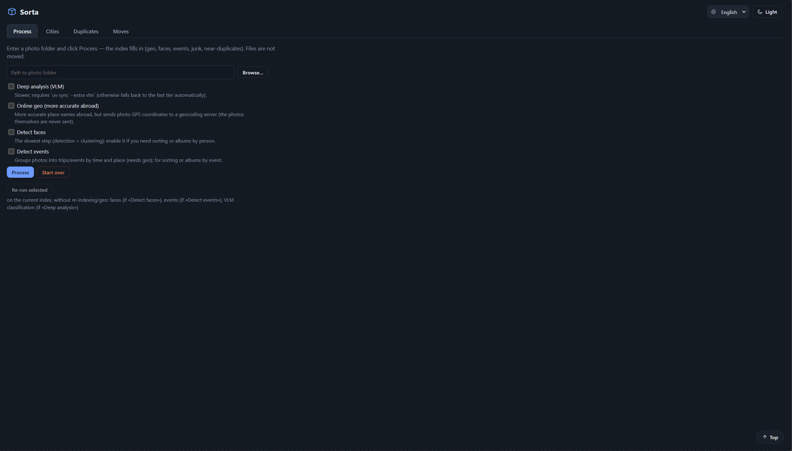
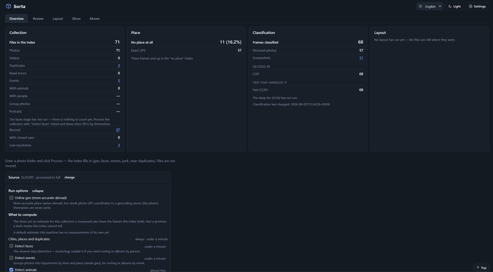
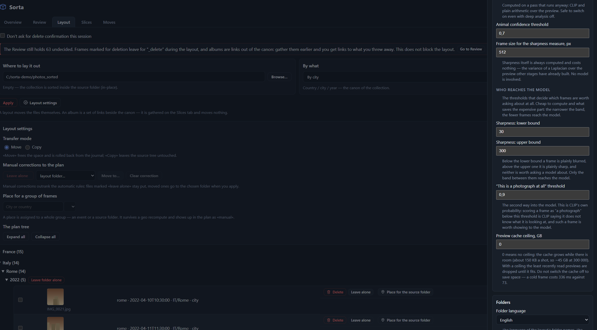

# Sorta

[](https://github.com/shinKatana0/sorta/actions/workflows/check.yml)
[](https://github.com/shinKatana0/sorta/releases/latest)
[](LICENSE)
[](pyproject.toml)

> 言語: [English](README.md) · [Русский](README.ru.md) · **日本語**

**大容量の写真・動画コレクション**（60 GB 超で動作確認、300 GB 超を想定した設計）を
**都市/国**・**人物**・**イベント**単位で整理し、きれいなフォルダ構成に**振り分ける**
ツールです。安全性を最優先: デフォルトは dry‑run、移動はジャーナルに記録され、
1コマンドで元に戻せます。

Sorta は**すべてローカルで動作**し（顔・シーン・テキストの ML モデルはお使いの
マシン上で実行）、**元の写真ファイルを一切変更しません**。**CLI** と、手順に沿って
操作できる**ローカル Web アプリ**の両方を用意しています。



<sub>合成のデモコレクションでのローカル Web アプリ（`sorta ui`）— 都市ツリー、フォルダ言語の即時切り替え（en/ru/ja）、重複レビュー。</sub>

> ⚡ **本製品は NVIDIA GPU（CUDA 13）を前提に作られています。** VRAM 6 GB で深層 VLM
> ティア以外はすべて動きます。その深層ティアは実測ピークが **20.5 GB** で、24 GB の
> カードが必要です。CPU プロファイルは残りを動かしますが、大規模コレクションでの
> 所要時間は一度も測っていません — [システム要件](#システム要件)を参照してください。

> 📖 **ユーザーガイド:** [English](docs/guide/user-guide.en.md) ·
> [Русский](docs/guide/user-guide.ru.md) · [日本語](docs/guide/user-guide.ja.md)

---

## 主な機能

- **都市 / 人物 / イベント別の整理**を単一のインデックスから。モードの切り替えに再スキャンは
  不要です。
- **オフライン逆ジオコーディング**（GeoNames を同梱）。GPS とセッション推定に対応し、
  オンラインの Nominatim/OSM も任意で利用できます。
- **この環境で実測。すべて有効の状態で。** **38,493 ファイル**（正本 26,137）との最初の
  対面に **4 時間 35 分**——空のデータベース、消去したプレビューキャッシュ、深層 VLM 層も
  有効。同じコレクションの再実行は **4 分 16 秒** でした。

  二つ目の数字は正確に読んでください。その実行で新規フレームは **4 枚** だけであり、これは
  「何も変わっていないことを確認する」費用であって「写真を追加する」費用ではありません。
  新しいフレームの費用は変わりません——高速層に加え、深層層では 1 枚あたり約 0.7 秒です。

  一つ目の数字の大半は深層層で、これは**既定で無効**であり、開始前に実行画面で費用が
  示されます。深層層なしなら同じコレクションでおよそ 1 時間です。深層層が生むのは高速層
  では作れないもの——`product` クラス——であり、増分実行なので費用は一度きりです。

  ハードウェア: RTX 5090（ノート向け）。これより弱いカードや CPU では、深層層の費用は
  数倍になります。後述の「非力なカードで動かす」を参照してください。
- **顔とイベントは任意**（`--faces` / `--events`、または対応するチェックボックス）。
  最も時間のかかる段階であり、全員に必要なものではありません。
- **顔と人物:** ローカルでの検出とクラスタリング（insightface）。クラスタに名前を付けて
  統合し、整理や人物別アルバムの作成ができます。**検索欄に名前を入力すると、その人物が
  見つかります**——統合したクラスタも含め、ランキングではなく厳密な抽出として。
- **言葉によるコレクション検索**（多言語 CLIP）。**任意のクエリを独立したタブとして
  固定**できます。組み込みのスライスも保存されたクエリなので、固定したものが劣るわけでは
  ありません。
- **写真が「何であるか」と「どう写ったか」のスライス:** 人物、子ども、動物、
  スクリーンショット、ミーム、書類、商品、ダウンロード画像、ぼけ、閉じた目、低解像度。
- **各スライスは測定値を明示します。**「モデルはこれらを画面と判断しています。およそ 3 枚に
  1 枚は通常の写真です。削除前に確認してください」という説明は、判定のふりをした数値より
  役に立ちます。リストは**しきい値ではなく順位付け**——製品が並べ、人がどこで止めるかを
  決めます。
- **重複:** 完全一致（blake3）と近似重複（知覚ハッシュ）を一括レビュー。
- **甘い写真の復元**は、効果がある場所でのみ提供します。ブラインド比較では、**小さな**画像で
  単純な拡大を上回りました（62% 対 10%）が、上限を超える画像では有意な差はなく、
  したがって操作もそこにだけ用意されています。
- **アルバム:** 任意のスライスやクエリを、**ハードリンク**（追加容量ほぼゼロ）・コピー・
  移動で名前付きフォルダにまとめられます。全部でなくてよいときは一部だけ選べます。
- **ローカル Web アプリ**（`sorta ui`）。タブはパイプラインの段階ではなく、ファイルに何を
  するかで分かれています: **概要**（コレクションの状態を 1 画面で）、**検討**（重複・ぼけ・
  閉じた目）、**配置**（どこへ、何を基準に）、**スライス**（クエリ・固定・組み込み）、
  **移動**（直近のバッチの内容と取り消し）。
- **3 言語**の UI とフォルダ名: **ru / en / ja**。
- **画像はマシンの外に出ません。** すべてのモデルはローカルで動作し、外部通信は任意の
  Nominatim のみ。送るのは丸めた**座標**であり、写真ではありません。
- **設計上の安全性:** ドライラン、ジャーナルと `undo`、blake3 による検証、上書きは一切
  しません（`_1`、`_2` の接尾辞）。

---





### 2 つの入口、それぞれの役割

**CLI はパイプラインを実行します**——全ステージ、`sort`、`album`、`search`、そして各
オプションの 1 回限りのフラグ。**Web アプリは判断する場所です**——重複の解消、場所の訂正、
クエリの固定、写真の復元。`sorta dupes` は重複を一覧しますが解消はしません。コマンド
ラインから解消するとは、写真を見ずに選ぶことであり、ブラインド比較では我々のどの規則も
偶然を上回りませんでした。再現できるものはすべてスクリプト化でき、判断を要するものは
スクリプト化できるふりをしません。

---

## システム要件

> [!WARNING]
> **Sorta は NVIDIA GPU を備えたマシンを前提にしています。** 実際に時間のかかる段階——
> 顔検出、CLIP 分類、深層 VLM 層——はいずれもニューラルネットワークであり、以下の数値は
> その上で測定したものです。
>
> **深層層には約 20.5 GB の VRAM が必要です。** これは推定ではなく実測のピークで、
> Qwen2.5‑VL‑3B がそれだけ占有し、2 つ目のコピーは載りません。24 GB のカードなら動き、
> 8〜12 GB のカードでは**遅くなるのではなく起動しません**。それ以外はずっと軽く、
> 約 3 GB です。したがって**都市別の整理・重複・顔・イベントは 6〜8 GB のカードで
> 快適に動きます**。
>
> **CPU プロファイルは動作しますが、通しで測定したことは一度もありません。** GPU のない
> マシンでもインデックス作成・位置の解決・重複検出・都市別整理ができるように存在して
> います。目安としては、小さなコレクション、または顔・イベント・深層層を切った大きな
> コレクションです。38,000 ファイルを通した人はまだおらず、所要時間を知っているふりは
> しません。


| | CPU プロファイル（`cpu` エクストラ） | GPU プロファイル（`gpu` エクストラ） |
|---|---|---|
| ハードウェア | 任意の x86‑64 マシン | NVIDIA GPU + **CUDA 13** 対応ドライバ |
| VRAM | 不要 | 深層ティア以外のすべてに **~3 GB**（RTX 5090 で実測: CLIP ViT‑L 2.0 GB + buffalo_l 0.6 GB）— **6 GB** で快適。**深層 VLM ティアは実測ピーク 20.5 GB** で、**24 GB** のカードが必要 |
| 速度 | 動作するが、大規模コレクションで**通しで測定したことはありません** | 2026‑08‑05 実測、38,485 ファイルをゼロから: index 5.3分 · geo 3秒（オフライン）· landmarks 4.9 · classify 32.4 · faces 14.2 · events 2秒 · junk 19.3 · phash 45秒 — 合計 **77.5分**。プレビューキャッシュが温まっていれば 10 分ほど短縮 |
| 向いている用途 | 任意のマシンでの都市別振り分け + 重複検出、顔検出/イベントを有効にした小規模コレクション | 顔検出/イベントを常用する大規模コレクション（300 GB 超） |

### 小さいカードで動かすには

20.5 GB のピークは、既定の入力サイズでの深層ティアの値です。つまみはあります。それぞれ
について実際に分かっていることは次のとおりです。

| つまみ | 効果 | 実測 |
|---|---|---|
| `vlm.enabled: false` | 深層ティアを一切読み込まない | 残りのパイプラインは約 3 GB — 小さなカードではこれが答えです |
| `vlm.max_edge` | モデルが見るフレームの大きさ。トークン数は面積に比例 | 896 → 672 で**速度 ×1.48**、ただし**書類の 7.5% が「写真」に変わります**（300 枚、F102）。既定が 896 のままなのはこの取引が割に合わないと判断したからで、つまみは別の判断をする人のために残しています |
| `vlm.workers` | GPU 用にフレームを準備するスレッド数 | CPU 側の準備を変えるだけで、VRAM は変わりません |
| `imaging.preview_cache_max_gb` | サムネイルキャッシュの上限 | メモリではなくディスク |

**規模について率直に言えば**、これらのどれも 20.5 GB を 8 GB にはしません。`vlm.max_edge`
を下げればトークン数が面積とともに減るのでピークも下がりますが、**どれだけ下がるかは
測っていません**——解像度の調査が測ったのは速度と判定であって、メモリではありません。
24 GB 未満のカードに対する正直な助言は、深層ティアを切ったままにすることです。それが
生むのは `product` という 1 つのクラスだけで、製品の他の部分はそれに依存していません。

両プロファイル共通: Python **3.11–3.14**、[`uv`](https://docs.astral.sh/uv/)、
そして **PATH 上の `exiftool`**（HEIC/RAW/動画のメタデータに必須 — ないと
Pillow にフォールバックし、JPEG/PNG/TIFF/WEBP のみ読み取り可能で動画は読めません）。
インデックス（SQLite）とサムネイル用のディスク容量はコレクションのサイズに応じて
増加します。`--copy` での振り分けはコレクションサイズの概ね ×2、`--link`
（ハードリンク）はほぼ追加容量なしで済みます。

上記のタイミングは当方の環境での参考値であり、保証するものではありません。
RAM/VRAM に関する詳細を含む完全な内訳は
[ユーザーガイド](docs/guide/user-guide.ja.md#2-必要要件) を参照してください。

---

## クイックスタート

### Windows: インストーラー（`uv` もターミナルも不要）

[リリースページ](https://github.com/shinKatana0/sorta/releases/latest)の
`sorta-<version>-setup.exe` は**基本ティアをまるごと**同梱し、インストール後は
ネットワークなしで動作します: インデックス、EXIF、位置情報、重複、都市別の振り分け。
ショートカットはトレイアイコン付きのウェブアプリを開き、コンソール窓は出ません。
重いティア — 顔（約 400 MB）、言葉による検索（約 3 GB）、NVIDIA/CUDA 13（約 2.5 GB）、
ディープ VLM ティア（約 7 GB）— は初回セットアップ（`sorta-setup`、いつでも再実行可）が
一度だけ尋ねます。**すべて断っても、削られた製品ではなく動く製品が残ります**。

> ⚠️ **インストーラーは署名されていません**。そのため Windows SmartScreen が
> 「Windows によって PC が保護されました」と表示します。**詳細情報** →
> **実行** の順にクリックしてください。リリースページにはファイルの `sha256` を併記して
> います（`Get-FileHash sorta-<version>-setup.exe` で確認できます）。コード署名証明書は
> 今回のリリースには含まれません。ビルド方法は
> [packaging/windows/README.md](packaging/windows/README.md) を参照してください。

以下は開発者・CLI 向けの手順です。変更はなく、インストーラーの動作とは別物です。

```bash
# 一度だけインストール — 以下から 1 つを選びます。エクストラはパッケージ指定の
# 「内側」に書き、ハードウェアプロファイルを決めます（`cpu` と `gpu` は排他）。
uv tool install "C:\path\to\sorta[cpu]"       # NVIDIA GPU なし — `sorta` を PATH に追加
uv tool install "C:\path\to\sorta[gpu]"       # NVIDIA GPU + CUDA 13 ドライバ
uv tool install "C:\path\to\sorta[gpu,vlm]"   # ...深い VLM ティアも
uv tool install -e "C:\path\to\sorta[gpu]"    # editable — ローカルでコードを触る場合

sorta doctor                            # 実際に何が入ったかを確認（最初にこれ）
cp config.example.yaml config.yaml      # `sources` と `language` を設定
# exiftool は HEIC/RAW/動画に必須 — 先にインストールしてください（「要件」参照）

# 一番簡単: Web アプリ
sorta ui                                # http://127.0.0.1:8756 → フォルダを処理 → 確認

# または CLI
sorta index /path/to/photos             # スキャン
sorta run                               # geo, junk + 近似重複ハッシュ（都市+重複）
sorta run --faces --events              # ...顔検出とイベント構築も行う
sorta run --landmarks                   # ...見た目による場所の判定も行う（重み 1.6 GB）
sorta sort --by city --dest /path/to/sorted            # dry-run プラン（CSV + HTML）
sorta sort --by city --dest /path/to/sorted --copy --apply   # 適用（copy は非破壊）
sorta undo                              # 必要なら直前のバッチを取り消し
```

> **`uv tool install` に `--extra` フラグはありません** — エクストラは上記のとおり
> 引用符付きのパッケージ指定の内側に書きます。付け忘れると、GPU 搭載機でも黙って
> **CPU プロファイル**（`torch==2.13.0+cpu`）が入ります。それを見つける手段が
> `sorta doctor` です: torch のビルド、onnxruntime のプロバイダ、地理データベース、
> ログとプレビューキャッシュのパスを表示します。

コードを開発する場合は、プロジェクトの venv を使ってください（`uv sync --extra
gpu --extra dev` の後にアクティベートし、同じ `sorta …` コマンドをそのまま実行
すればコードの変更が即反映されます）。すべてのインストール方法、`sorta doctor` の
出力の読み方、`onnxruntime`/`onnxruntime-gpu` の落とし穴、そして素の
`uv run sorta …` がその 1 つでは*ない*理由は、ユーザーガイドの
[「インストール」](docs/guide/user-guide.ja.md#3-インストール)を参照してください。

大きな実行の前に知っておくとよいことが 2 つあります。Sorta は**プレビュー
キャッシュ**（フレームごとに 1 回だけデコード、1 枚あたり約 150 KB — 大規模
コレクションではギガバイト単位。確認は `sorta cache`、削除は `sorta cache --clear`）
を持ち、段階ごとの所要時間を含む**実行ログ**を
`%LOCALAPPDATA%\sorta\logs\sorta.log`（他 OS では `~/.cache/sorta/logs/sorta.log`）
に書き出します。詳細はユーザーガイドにあります。

実際のコマンド出力付きの完全なウォークスルー、コマンドリファレンス、設定
リファレンスは [ユーザーガイド](docs/guide/user-guide.ja.md) にあります。

---

## 安全性とプライバシー

- **元ファイルは一切変更されません。** 振り分けはファイルの移動/コピーのみ行い、
  EXIF は書き換えません。
- **デフォルトは dry‑run。** すべての操作は実行前にジャーナルへ記録され、
  `sorta undo` で取り消せます。
- **画像がマシンの外に出ることはありません。**「デフォルトで無効」ではなく、
  送信するコード自体が残っていません。クラウドのイベント命名プロバイダは
  アップロード処理ごと削除され、その名前が黙って戻らないようテストが見張っています。
  外部通信は任意の Nominatim ジオコーディングだけで、送るのは**丸めた座標**であり
  写真ではありません。詳細は [SECURITY.md](SECURITY.md) を参照してください。
- **書類**（パスポート、レシート、医療書類など）はローカルのレビュー用フォルダ
  `_未分類/文書/` に収集され、お使いのマシン上でのみ処理されます。
- Web アプリは `127.0.0.1` のみで待ち受けます。

詳細は [SECURITY.md](SECURITY.md) を参照してください。

---

## ドキュメント

- **[ユーザーガイド](docs/guide/user-guide.ja.md)** — インストール、設定、
  ワークフロー、コマンド/設定リファレンス、トラブルシューティング（EN / RU / JA）
- `docs/ARCHITECTURE.md` — アーキテクチャ、モジュールの所有権、データ契約
- `CONTRIBUTING.md` — 貢献方法 · `SECURITY.md` — プライバシーと報告 ·
  `NOTICE` — サードパーティデータの帰属表示（GeoNames、OpenStreetMap/Nominatim）

---

## 開発

```bash
uv sync --extra cpu --extra dev         # または --extra gpu
uv run python scripts/check.py          # ゲート: ruff + mypy + pytest（カバレッジ込み）
```

完全なセットアップとゲートの詳細は [CONTRIBUTING.md](CONTRIBUTING.md) を参照して
ください。

## ライセンス

MIT — [LICENSE](LICENSE) を参照。使用/参照するサードパーティの地理データには
独自の帰属表示要件があります — [NOTICE](NOTICE) を参照してください。
